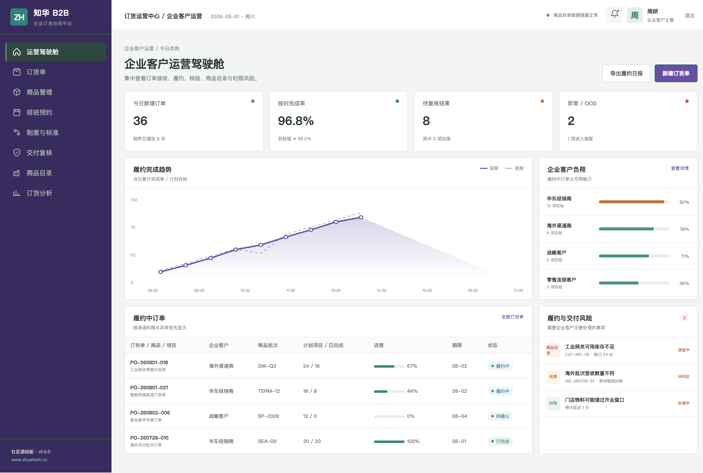
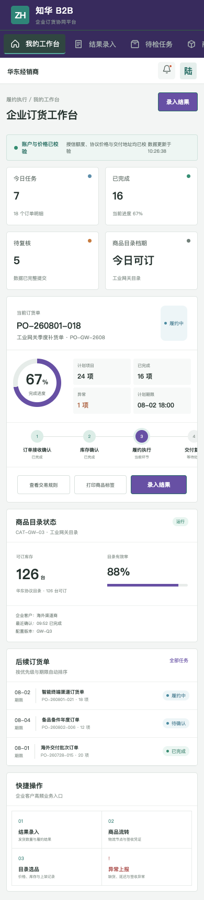

# ZhuaTech B2B

> 企业客户订货协同平台：让协议价格、可订库存、订单履约和物流回单真正连起来。

[产品官网](https://www.zhuatech.cn/) · [部署说明](deploy/README.md) · [接口文档](docs/api.md) · [许可条款](LICENSE)

---

ZhuaTech B2B 是知华科技（上海如静知华信息科技有限公司）提供的企业订货协同社区源码版。系统采用 Java + Vue 前后端分离架构，同时包含运营管理端和企业采购员 H5 端。

## 运营端：客户、订单、交付统一管理

运营人员可查看企业客户负荷、在途订单、商品目录、价格复核、交付异常和履约趋势。



## 客户端：移动订货与履约跟踪

企业采购员可在移动端查看协议商品、订单进度、物流节点、签收情况，并提交交付异常。



## 能力地图

```text
企业账户与授信
    ├── 协议价格与商品目录
    ├── 采购订单与拆单
    ├── 库存确认与交付计划
    ├── 发货、物流、签收与回单
    └── 缺货、延迟、差异与售后协同
```

管理端提供经营指标、履约时效、客户订单与异常处理；H5 端覆盖客户选品、订单查看、履约确认和问题反馈。所有客户、订单、库存、价格和经营指标均为虚构演示数据。

## 开发栈

| 层次 | 选型 |
| --- | --- |
| API | Java 21、Spring Boot、Spring Security、JWT、JPA、Flyway |
| Web / H5 | Vue 3、Pinia、Vue Router、Axios、Vite |
| 数据 | MySQL 8；H2 集成测试 |
| 交付 | Docker Compose、Nginx、环境变量配置 |

Java 工程包名为 `cn.zhuatech.b2b`，数据库名为 `zhuatech_b2b`。

## 现在运行

```bash
cd frontend
npm install
npm run dev:demo
```

打开 `http://localhost:5173`。运营管理端：`planner / Demo@2026`；企业采购员端：`operator / Demo@2026`。完整环境可执行：

```bash
cp .env.example .env
docker compose up --build
```

## 使用与授权

本工程仅允许个人学习、研究和非商业技术交流，**不得商用**。企业内部使用、生产部署、SaaS、客户交付、收费培训、咨询实施、品牌替换或再分发等商业用途，须提前取得上海如静知华信息科技有限公司书面授权，详见 [LICENSE](LICENSE)。

需要商城订货、ERP/WMS 对接、客户门户、私有化部署或商业授权，请访问[知华科技官网](https://www.zhuatech.cn/)，也可扫码添加微信：

| 咨询二维码 1 | 咨询二维码 2 |
| --- | --- |
|  |  |

关键词：B2B 订货系统源码、企业商城、经销商订货、订单履约、Java B2B、Vue 企业订货、知华科技。

## 订单授信决策

新增 `POST /api/admin/credit-decision`，把新订单金额、已用额度、逾期天数和履约争议合并为授信利用率和风险分。超额度订单自动阻断，并给出提高预付款、结清逾期和关闭争议等释放条件。

## 订单履约风险

新增 `POST /api/b2b/insights/fulfillment-risk`，结合分配率、发货进度、承诺日期、供应商延迟和库存冻结，输出 `ON_TRACK`、`EXPEDITE` 或 `BLOCK_OR_NOTIFY`。
